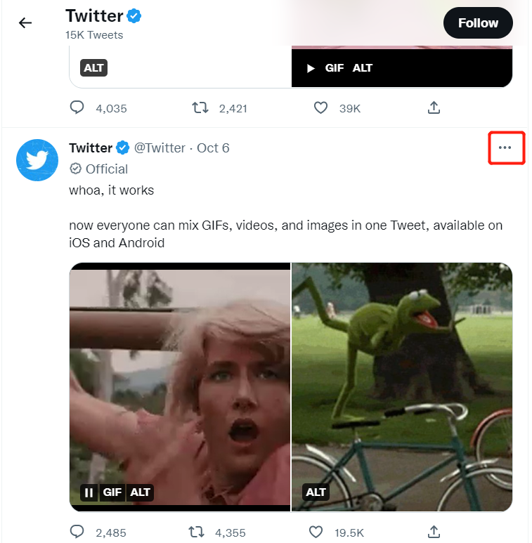
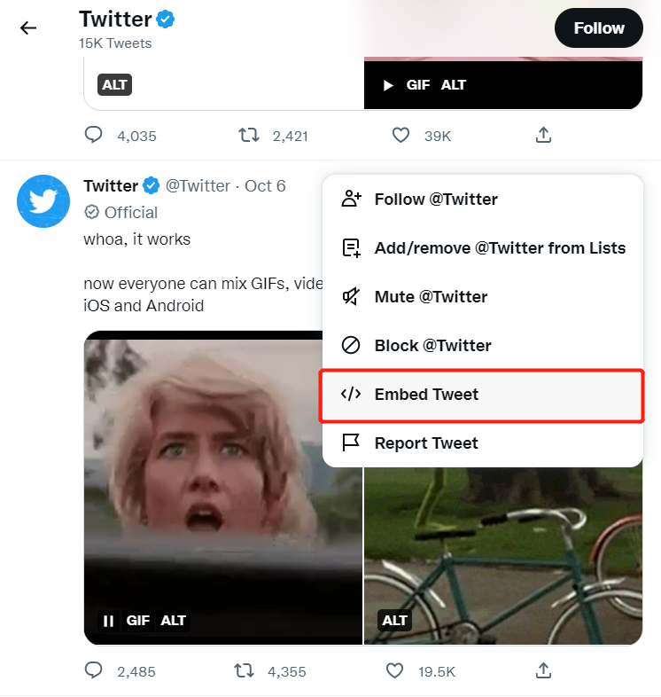
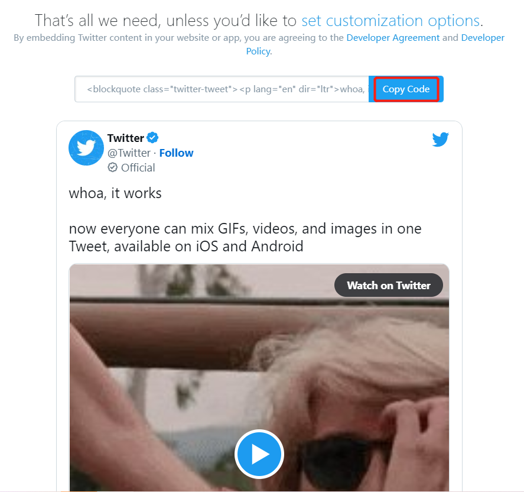

# 如何在前端页面嵌入YouTube视频和推文

## Twitter:

1. 如图所示,选择一篇推文, 点击右上角三个点的 `more` 按钮

2. 随后将出现一个菜单,点击`Embed Twitter`

3. 然后将会打开一个新窗口, 跳转至 https://publish.twitter.com/ , 点击`Copy Code`,复制推文代码块, 粘贴至编辑器即可

## YouTube:

1. 进入要分享的视频下面, 点击视频下方`分享` 按钮

2. 随后会弹出一个弹窗, 我们继续点击`嵌入`按钮

3. 然后和Twitter一样, 复制YouTube提供的代码, 粘贴到编辑器上即可